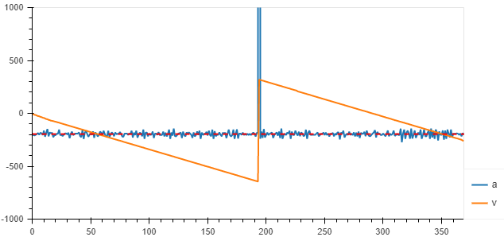

# Roblox Units

We need to find the necessary units in Roblox

## Fundamental SI Units

|Quantity| Roblox Unit | SI conversion
|--------|-------------|-----------------|
|Length | stud ($st$) | $1 st$ = $0.28m$|
|Time   | second ($s$) | $1s = 1s$|
|Mass   | roblox kg ($kg$) | $1rkg = ???kg$

## Derived Units
|Quantity| Roblox Unit | SI conversion
|--------|-------------|-----------------|
|Force  | Fig ($F$)    | $1F = ??N$ ($1N = 1kg \frac{m}{s^2}$) |
|Density| ??? rkg per cubic stud ($\frac{kg}{st^3}$) ???| 


--------
1. Confirm acceleration due to gravity is $g = 196.2 st/s^2$
according to [posts online](https://developer.roblox.com/en-us/api-reference/property/Workspace/Gravity), the value should be $196.2 st/s^2 $
    * Can we simply print out the value of `workspace.Gravity` to confirm?
    * Calculate and print the acceleration of a falling object using [this code](https://devforum.roblox.com/t/how-do-you-get-a-players-acceleration/181983/2)
    ```lua
    wait(0.2)
    local hrp=game:GetService("Players").LocalPlayer.Character:WaitForChild("HumanoidRootPart")

    local pv=Vector3.new()
    local a=Vector3.new()

    game:GetService("RunService").Heartbeat:Connect(function(dt)
        local nv=hrp.Velocity
        
        a=(nv-pv)/dt
        pv=nv
        
        print(a.Magnitude>0 and a.Unit or a)
    end)
    ```
    
    * Fancy pendulum experiment? might be fun but un-necessary

------------------------

2. Confirm the value of a roblox force is $1F = 1kg \frac{st}{s^2}$
    * make a part of a known mass ($1 kg$)
    * in theory, the force on the object due to gravity will be 
        $$F = mg$$
        $$F = 1kg * -196.2 \frac{st}{s^2}$$
        $$F = -196.2 kg \frac{st}{s^2} = -196.2 F$$
    * if we apply an upward force of $196.2F$, and the block does not accelerate, we have confirmed the units of $Figs$ to be $1rkg \frac{st}{s^2}$

